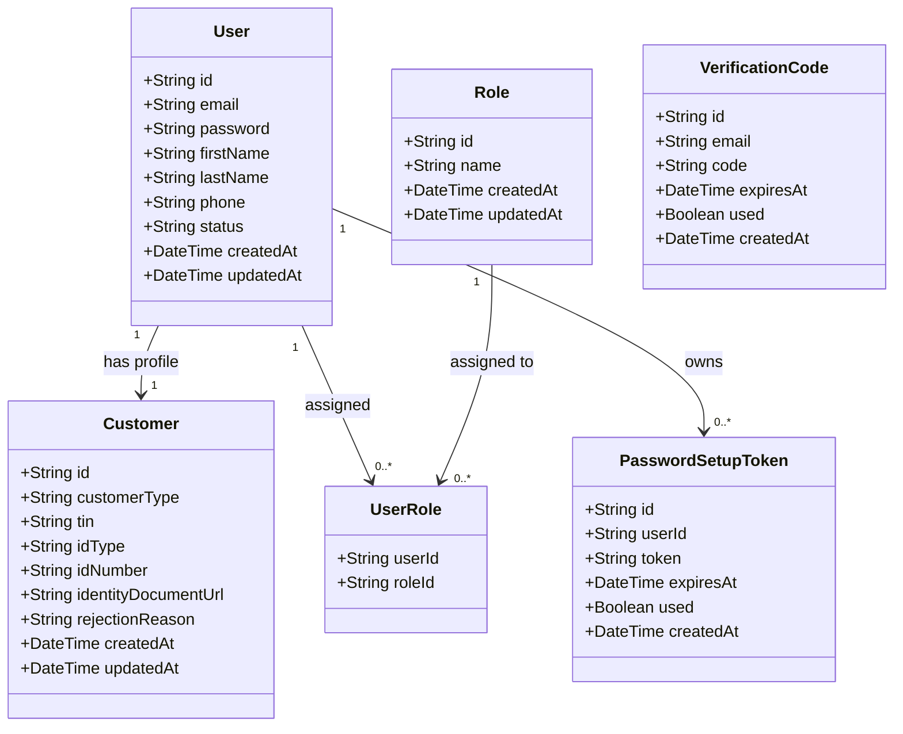
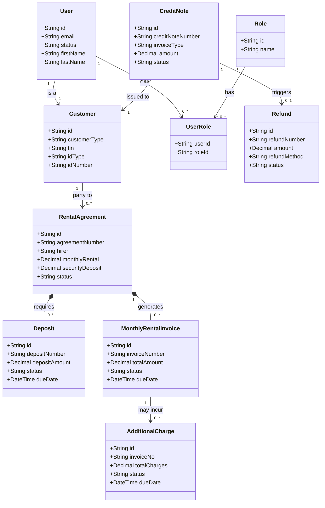

# Class Diagram: User Management & Billing Module

## User Management Class Diagram

```mermaid
classDiagram
    class User {
        +String id
        +String email
        +String password
        +String firstName
        +String lastName
        +String phone
        +String status
        +DateTime createdAt
        +DateTime updatedAt
    }

    class Customer {
        +String id
        +String customerType
        +String tin
        +String idType
        +String idNumber
        +String identityDocumentUrl
        +String rejectionReason
        +DateTime createdAt
        +DateTime updatedAt
    }

    class Role {
        +String id
        +String name
        +DateTime createdAt
        +DateTime updatedAt
    }

    class UserRole {
        +String userId
        +String roleId
    }

    class PasswordSetupToken {
        +String id
        +String userId
        +String token
        +DateTime expiresAt
        +Boolean used
        +DateTime createdAt
    }

    class VerificationCode {
        +String id
        +String email
        +String code
        +DateTime expiresAt
        +Boolean used
        +DateTime createdAt
    }

    User "1" --> "1" Customer : has profile
    User "1" --> "0..*" UserRole : assigned
    Role "1" --> "0..*" UserRole : assigned to
    User "1" --> "0..*" PasswordSetupToken : owns
```

---

## Billing Module Class Diagram

```mermaid
classDiagram
    class RentalAgreement {
        +String id
        +String agreementNumber
        +String poNumber
        +String projectName
        +String owner
        +String ownerPhone
        +String hirer
        +String hirerPhone
        +String location
        +String termOfHire
        +Int totalRentalMonth
        +Decimal monthlyRental
        +Decimal securityDeposit
        +Decimal minimumCharges
        +Decimal defaultInterest
        +String ownerSignatoryName
        +String ownerNRIC
        +String hirerSignatoryName
        +String hirerNRIC
        +String ownerSignature
        +String hirerSignature
        +DateTime ownerSignatureDate
        +DateTime hirerSignatureDate
        +String signedDocumentUrl
        +String signedStatus
        +String status
        +Int currentVersion
        +String createdBy
        +DateTime createdAt
        +DateTime updatedAt
    }

    class AgreementItem {
        +String id
        +String agreementId
        +String scaffoldingItemId
        +String scaffoldingItemName
        +Decimal agreedMonthlyRate
        +Int minimumRentalMonths
        +DateTime createdAt
    }

    class AgreementVersion {
        +String id
        +Int versionNumber
        +String changes
        +String allowedRoles
        +String createdBy
        +DateTime createdAt
        +Json snapshot
        +String agreementId
    }

    class ProjectClosureRequest {
        +String id
        +String closureRequestNumber
        +String agreementId
        +DateTime requestDate
        +String status
        +String approvedBy
        +DateTime approvedAt
        +DateTime createdAt
        +DateTime updatedAt
    }

    class Deposit {
        +String id
        +String depositNumber
        +String agreementId
        +Decimal depositAmount
        +String status
        +DateTime dueDate
        +String paymentProofUrl
        +String paymentProofFileName
        +DateTime paymentProofUploadedAt
        +String paymentProofUploadedBy
        +DateTime paymentSubmittedAt
        +String approvedBy
        +DateTime approvedAt
        +String referenceNumber
        +String rejectedBy
        +DateTime rejectedAt
        +String rejectionReason
        +DateTime createdAt
        +DateTime updatedAt
    }

    class MonthlyRentalInvoice {
        +String id
        +String invoiceNumber
        +String deliveryRequestId
        +String agreementId
        +String customerName
        +String customerEmail
        +String customerPhone
        +Int billingMonth
        +Int billingYear
        +DateTime billingStartDate
        +DateTime billingEndDate
        +Int daysInPeriod
        +Decimal baseAmount
        +Decimal overdueCharges
        +Decimal totalAmount
        +String status
        +DateTime dueDate
        +String paymentProofUrl
        +String paymentProofFileName
        +DateTime paymentProofUploadedAt
        +String paymentProofUploadedBy
        +String approvedBy
        +DateTime approvedAt
        +String referenceNumber
        +String rejectedBy
        +DateTime rejectedAt
        +String rejectionReason
        +DateTime createdAt
        +DateTime updatedAt
    }

    class MonthlyRentalInvoiceItem {
        +String id
        +String invoiceId
        +String scaffoldingItemId
        +String scaffoldingItemName
        +Int quantityBilled
        +Decimal unitPrice
        +Decimal lineTotal
        +DateTime createdAt
    }

    class AdditionalCharge {
        +String id
        +String invoiceNo
        +String openRepairSlipId
        +String returnRequestId
        +String deliverySetId
        +String conditionReportId
        +String customerName
        +String doId
        +String returnedDate
        +DateTime dueDate
        +String status
        +Decimal totalCharges
        +String proofOfPaymentUrl
        +String referenceId
        +String rejectionReason
        +DateTime approvalDate
        +DateTime rejectionDate
        +String uploadedByEmail
        +DateTime createdAt
        +DateTime updatedAt
    }

    class AdditionalChargeItem {
        +String id
        +String additionalChargeId
        +String itemName
        +String itemType
        +String repairDescription
        +Int quantity
        +Decimal unitPrice
        +Decimal amount
        +DateTime createdAt
        +DateTime updatedAt
    }

    class CreditNote {
        +String id
        +String creditNoteNumber
        +String customerName
        +String customerId
        +String invoiceType
        +String sourceId
        +String originalInvoice
        +String deliveryOrderId
        +String agreementId
        +Decimal amount
        +String reason
        +String reasonDescription
        +DateTime date
        +String status
        +String createdBy
        +DateTime createdAt
        +DateTime updatedAt
        +String approvedBy
        +DateTime approvedAt
        +String rejectedBy
        +DateTime rejectedAt
        +String rejectionReason
    }

    class CreditNoteItem {
        +String id
        +String creditNoteId
        +String description
        +Int quantity
        +Decimal previousPrice
        +Decimal currentPrice
        +Decimal unitPrice
        +Decimal amount
        +DateTime createdAt
    }

    class CreditNoteAttachment {
        +String id
        +String creditNoteId
        +String fileName
        +String fileUrl
        +Int fileSize
        +DateTime uploadedAt
    }

    class CreditNoteApplication {
        +String id
        +String creditNoteId
        +String targetInvoiceType
        +String targetInvoiceId
        +String targetInvoiceNumber
        +Decimal amountApplied
        +String appliedBy
        +DateTime appliedAt
        +String notes
    }

    class Refund {
        +String id
        +String refundNumber
        +String invoiceType
        +String sourceId
        +String originalInvoice
        +String customerName
        +String customerId
        +String creditNoteId
        +String creditNoteNumber
        +Decimal amount
        +String refundMethod
        +String reason
        +String reasonDescription
        +String status
        +String createdBy
        +DateTime createdAt
        +DateTime updatedAt
        +String approvedBy
        +DateTime approvedAt
        +String rejectedBy
        +DateTime rejectedAt
        +String rejectionReason
    }

    class RefundAttachment {
        +String id
        +String refundId
        +String fileName
        +String fileUrl
        +Int fileSize
        +DateTime uploadedAt
    }

    RentalAgreement "1" *-- "0..*" AgreementItem : contains
    RentalAgreement "1" *-- "0..*" AgreementVersion : versioned by
    RentalAgreement "1" *-- "0..*" ProjectClosureRequest : closed via
    RentalAgreement "1" *-- "0..*" Deposit : requires
    RentalAgreement "1" *-- "0..*" MonthlyRentalInvoice : generates

    MonthlyRentalInvoice "1" *-- "0..*" MonthlyRentalInvoiceItem : itemized by

    AdditionalCharge "1" *-- "0..*" AdditionalChargeItem : itemized by

    CreditNote "1" *-- "0..*" CreditNoteItem : itemized by
    CreditNote "1" *-- "0..*" CreditNoteAttachment : has
    CreditNote "1" *-- "0..*" CreditNoteApplication : applied via
    CreditNote "1" --> "0..1" Refund : triggers

    Refund "1" *-- "0..*" RefundAttachment : has
```

---

## Combined Overview Class Diagram

```mermaid
classDiagram
    class User {
        +String id
        +String email
        +String status
        +String firstName
        +String lastName
    }

    class Customer {
        +String id
        +String customerType
        +String tin
        +String idType
        +String idNumber
    }

    class Role {
        +String id
        +String name
    }

    class UserRole {
        +String userId
        +String roleId
    }

    class RentalAgreement {
        +String id
        +String agreementNumber
        +String hirer
        +Decimal monthlyRental
        +Decimal securityDeposit
        +String status
    }

    class Deposit {
        +String id
        +String depositNumber
        +Decimal depositAmount
        +String status
        +DateTime dueDate
    }

    class MonthlyRentalInvoice {
        +String id
        +String invoiceNumber
        +Decimal totalAmount
        +String status
        +DateTime dueDate
    }

    class AdditionalCharge {
        +String id
        +String invoiceNo
        +Decimal totalCharges
        +String status
        +DateTime dueDate
    }

    class CreditNote {
        +String id
        +String creditNoteNumber
        +String invoiceType
        +Decimal amount
        +String status
    }

    class Refund {
        +String id
        +String refundNumber
        +Decimal amount
        +String refundMethod
        +String status
    }

    User "1" --> "1" Customer : is a
    User "1" --> "0..*" UserRole : has
    Role "1" --> "0..*" UserRole : has
    Customer "1" --> "0..*" RentalAgreement : party to
    RentalAgreement "1" *-- "0..*" Deposit : requires
    RentalAgreement "1" *-- "0..*" MonthlyRentalInvoice : generates
    MonthlyRentalInvoice "1" --> "0..*" AdditionalCharge : may incur
    CreditNote "0..*" --> "1" Customer : issued to
    CreditNote "1" --> "0..1" Refund : triggers
```
