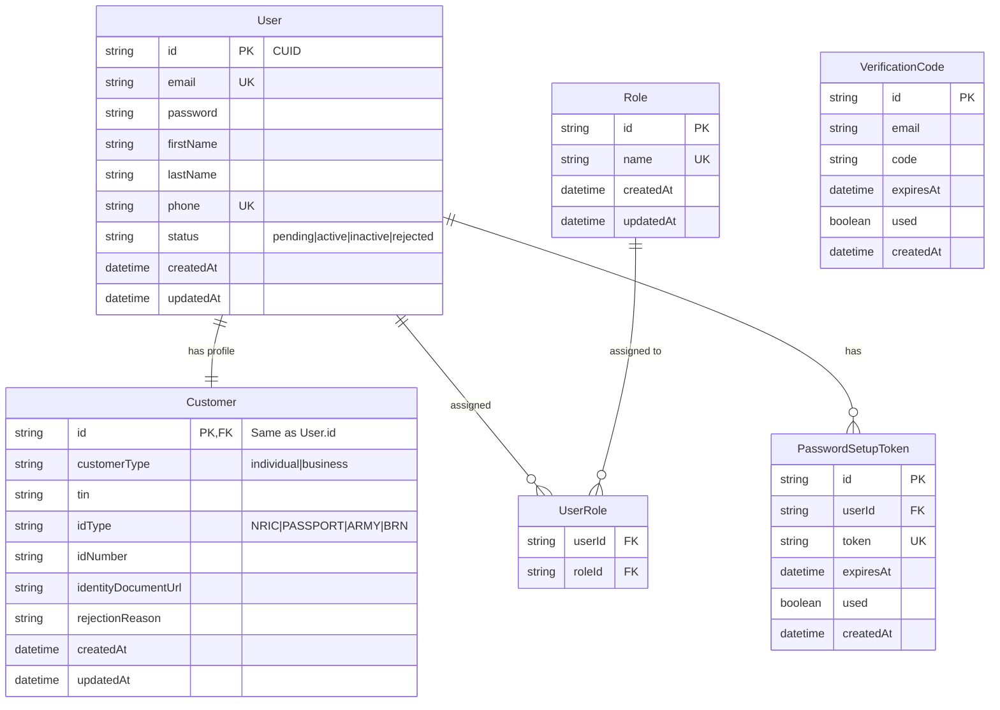
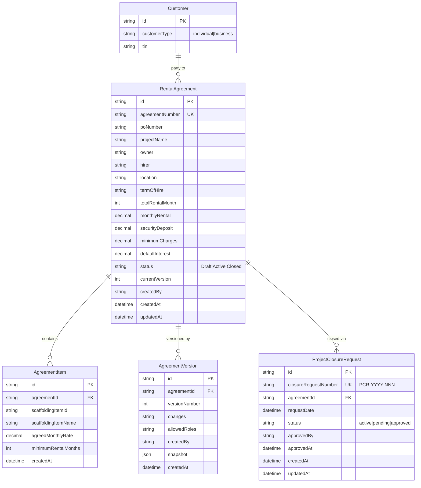
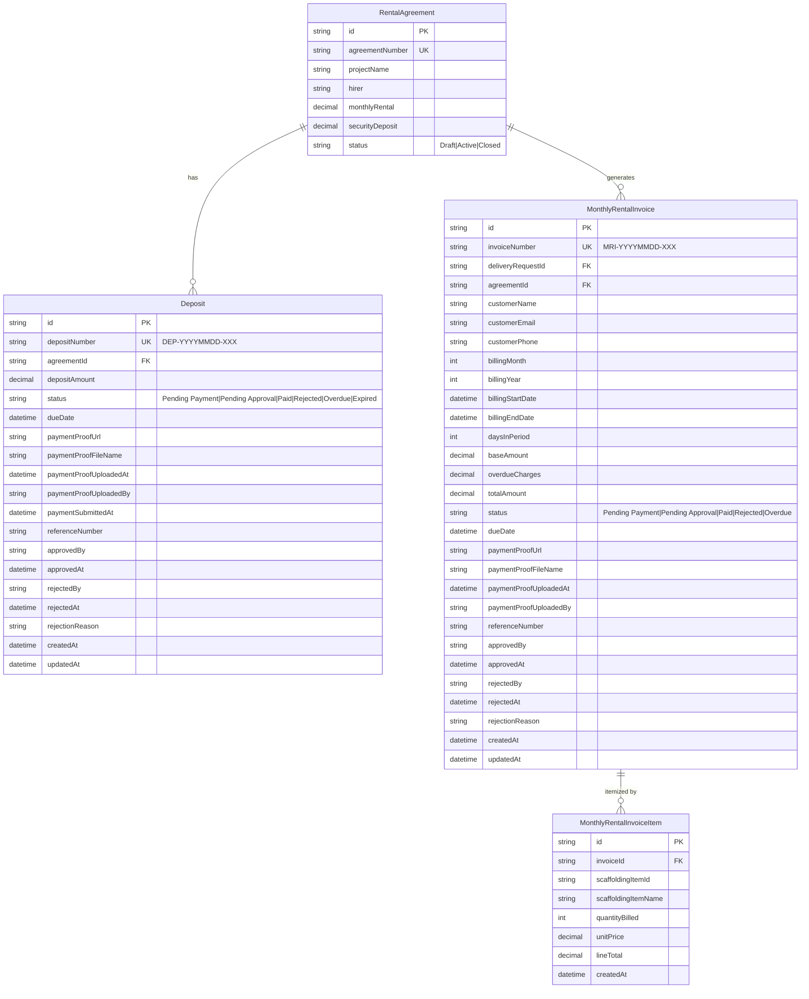
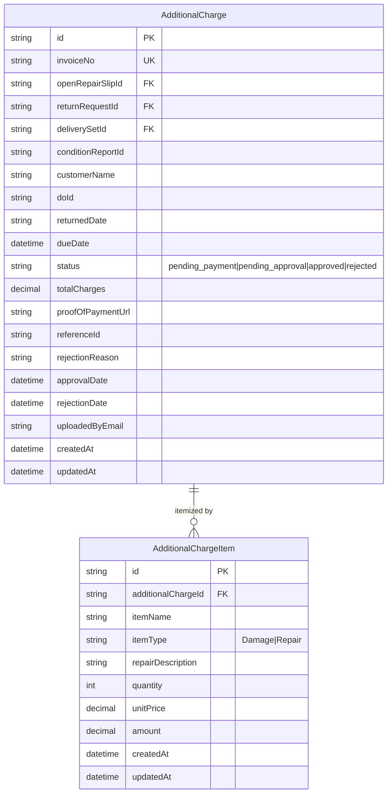
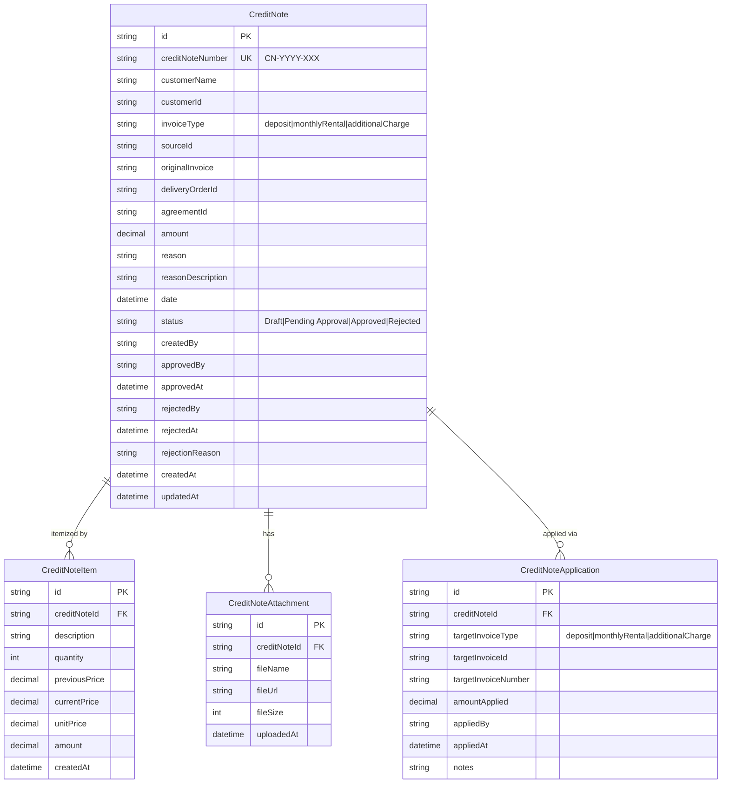
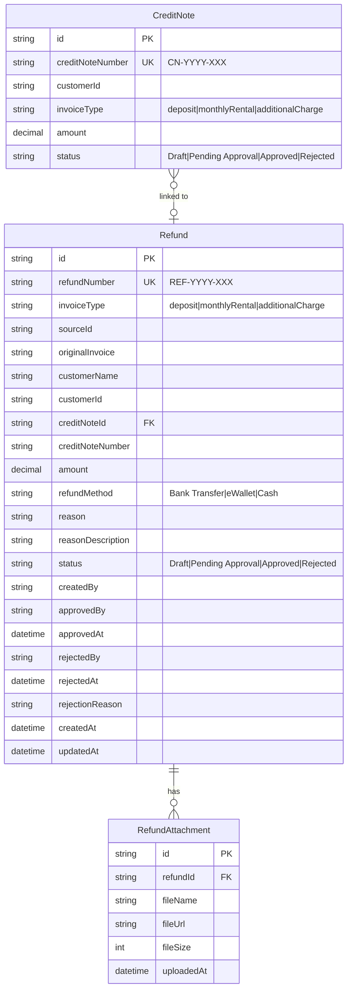
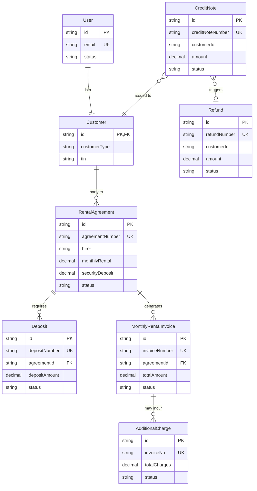

# ERD: User Management & Billing Module

## User Management ERD

---

## Billing Module ERD — Part 1a: Agreement Management

> Covers: Customer, RentalAgreement, AgreementItem, AgreementVersion, ProjectClosureRequest

---

## Billing Module ERD — Part 1b: Deposit & Monthly Invoicing

> Covers: RentalAgreement, Deposit, MonthlyRentalInvoice, MonthlyRentalInvoiceItem

---

## Billing Module ERD — Part 2a: Additional Charges

> Covers: AdditionalCharge, AdditionalChargeItem

---

## Billing Module ERD — Part 2b: Credit Notes

> Covers: CreditNote, CreditNoteItem, CreditNoteAttachment, CreditNoteApplication

---

## Billing Module ERD — Part 2c: Refunds

> Covers: CreditNote, Refund, RefundAttachment

---

## Combined Overview ERD (User → Billing)

